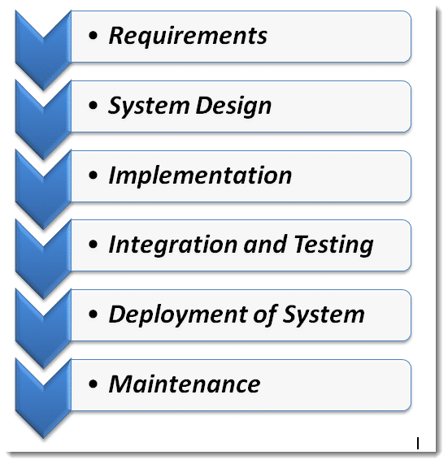

# The Waterfall Process Model

#### WARNING: The content of this page is completely from <a href="https://www.toolsqa.com/software-testing/waterfall-model">TOOLSQA</a>.

## The Waterfall Model:

The Waterfall Model was the first process model to be introduced. It is very simple to understand and use. In a Waterfall model, each phase must be completed before the next phase can begin and there is no overalpping in the phases.

In <b>the waterfall</b> approach, the whole process of software development is divided into separate phases. The outcome of one phase acts as the input for the next phase sequentially. <b><em>This means that any phase in the development process begins only if the previous phase is complete</em></b>. 

The waterfall model is a sequential design process in which progress is seen as flowing steadily downwards (like a waterfall) through the phases of Conception, Initiation, Analysis, Design, Construction, Testing, Production/Implementation, and Maintenance.

As the Waterfall Model illustrates the software development process in a linear sequential flow; hence it is also referred to as a Linear-Sequential Life Cycle Model.

#### Sequential Phases in the Waterfall Model

- <b>Requirements:</b> The first phase involves understanding what needs to design and what is its function, purpose, etc. Here, the specifications of the input and output or the final product are studied and marked.

- <b>System Design:</b> The requirement specifications from the first phase are studied in this phase and system design is prepared. System Design helps in specifying hardware and system requirements and also helps in defining overall system architecture. The software code to be written in the next stage is created now.

- <b>Implementation:</b> With inputs from system design, the system is first developed in small programs called units, which are integrated into the next phase. Each unit is developed and tested for its functionality which is referred to as Unit Testing.

- <b>Integration and Testing:</b> All the units developed in the implementation phase are integrated into a system after testing of each unit. The software designed, needs to go through constant software testing to find out if there are any flaws or errors. Testing is done so that the client does not face any problem during the installation of the software.

- <b>Deployment of System:</b> Once the functional and non-functional testing is done, the product is deployed in the customer environment or released into the market.

- <b>Maintenance:</b> This step occurs after installation, and involves making modifications to the system or an individual component to alter attributes or improve performance. These modifications arise either due to change requests initiated by the customer, or defects uncovered during live use of the system. The client is provided with regular maintenance and support for the developed software.

All these phases are cascaded to each other in which progress is seen as flowing steadily downwards (like a waterfall) through the phases. The next phase is started only after the defined set of goals is achieved for the previous phase and it is signed off, so the name “Waterfall Model“.

#### Advantages of the Waterfall Model

- The advantage of waterfall development is that it allows for departmentalization and control. A schedule can be set with deadlines for each stage of development and a product can proceed through the development process model phases one by one. 

- The waterfall model progresses through easily understandable and explainable phases and thus it is easy to use. 

- It is easy to manage due to the rigidity of the model – each phase has specific deliverables and a review process.

- In this model, phases are processed and completed one at a time and they do not overlap. The waterfall model works well for smaller projects where requirements are very well understood.

#### Disadvantages of Waterfall Model

- It is difficult to estimate time and cost for each phase of the development process.

- Once an application is in the testing stage, it is very difficult to go back and change something that was not well-thought-out in the concept stage. 

- Not a good model for complex and object-oriented projects. 

- Not suitable for the projects where requirements are at a moderate to high risk of changing.
